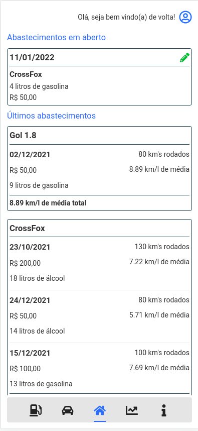
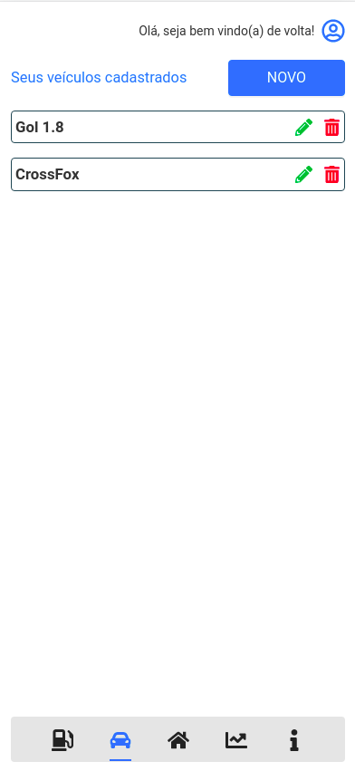
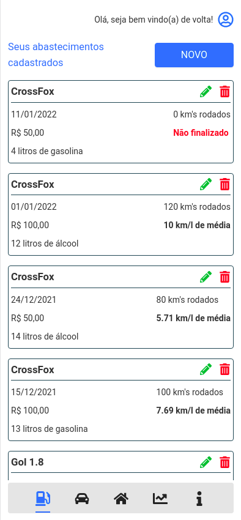
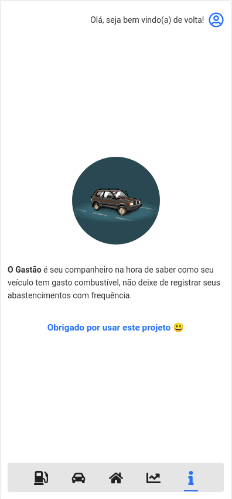

# O Gastão
Projeto para cadastro e controle de gastos com combustível. Construído em [React] e [TypeScript].

## Apresentação
Abaixo algumas telas do projeto.

## Requisitos
- [Node.js] - Node.js na versão 14 ou superior;

## Instalação
Após clonar este projeto, em seu terminal de comandos, execute *npm install* para instalar as dependências e em seguida, *npm start* para que o projeto seja executado.

## Utilização
É possíve acessar o projeto em execução atráves do endereço **http://localhost:3000**.

## Contato
welingtonfidelis@gmail.com
 
Sugestões e pull requests são sempre bem vindos 🤓 

License
----

MIT

**Free Software, Hell Yeah!**

[Node.js]: <https://nodejs.org/en/>
[TypeScript]: <https://www.typescriptlang.org/>
[Next.js]: <https://nextjs.org/>
[Online Tutorials]: <https://www.youtube.com/channel/UCbwXnUipZsLfUckBPsC7Jog>